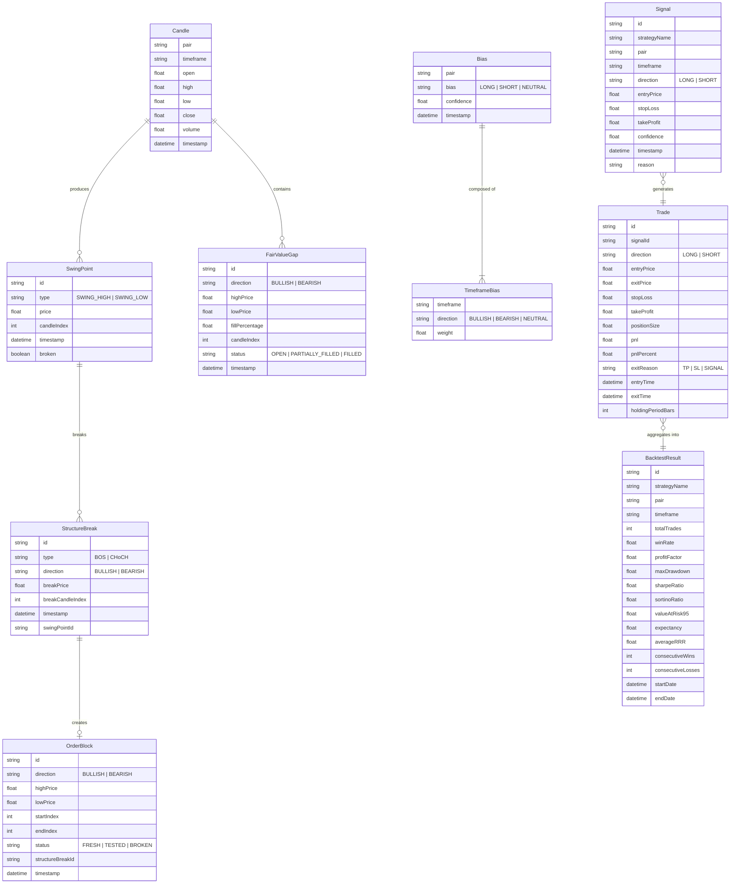

# ERD — TradeLab CLI Data Models

> 핵심 데이터 모델 및 관계 정의

---

## Entity Relationship Diagram



---

## Core Types (TypeScript)

### Market Data

```typescript
// === Timeframe ===
type Timeframe = 'M1' | 'M5' | 'M15' | 'M30' | 'H1' | 'H4' | 'D1' | 'W1';

// === Candle (OHLCV) ===
interface Candle {
  pair: string;
  timeframe: Timeframe;
  open: number;
  high: number;
  low: number;
  close: number;
  volume: number;
  timestamp: Date;
}
```

### SMC Structures

```typescript
// === Swing Point ===
type SwingType = 'SWING_HIGH' | 'SWING_LOW';

interface SwingPoint {
  id: string;
  type: SwingType;
  price: number;
  candleIndex: number;
  timestamp: Date;
  broken: boolean;
}

// === Structure Break (BOS / CHoCH) ===
type BreakType = 'BOS' | 'CHoCH';
type MarketDirection = 'BULLISH' | 'BEARISH' | 'NEUTRAL';

interface StructureBreak {
  id: string;
  type: BreakType;
  direction: MarketDirection;
  breakPrice: number;
  breakCandleIndex: number;
  timestamp: Date;
  swingPointId: string; // 돌파된 swing point 참조
}

// === Order Block ===
type OBStatus = 'FRESH' | 'TESTED' | 'BROKEN';

interface OrderBlock {
  id: string;
  direction: MarketDirection;
  highPrice: number;
  lowPrice: number;
  startIndex: number;
  endIndex: number;
  status: OBStatus;
  structureBreakId: string; // 관련 BOS 참조
  timestamp: Date;
}

// === Fair Value Gap ===
type FVGStatus = 'OPEN' | 'PARTIALLY_FILLED' | 'FILLED';

interface FairValueGap {
  id: string;
  direction: MarketDirection;
  highPrice: number;
  lowPrice: number;
  fillPercentage: number; // 0.0 ~ 1.0
  candleIndex: number;
  status: FVGStatus;
  timestamp: Date;
}
```

### Analysis Results

```typescript
// === SMC Analysis Result ===
interface SMCAnalysis {
  pair: string;
  timeframe: Timeframe;
  candles: Candle[];
  swingPoints: SwingPoint[];
  structureBreaks: StructureBreak[];
  orderBlocks: OrderBlock[];
  fairValueGaps: FairValueGap[];
  currentDirection: MarketDirection;
  analyzedAt: Date;
}

// === Timeframe Bias ===
interface TimeframeBias {
  timeframe: Timeframe;
  direction: MarketDirection;
  weight: number; // 0.0 ~ 1.0
}

// === Composite Bias ===
interface Bias {
  pair: string;
  bias: 'LONG' | 'SHORT' | 'NEUTRAL';
  confidence: number; // 0.0 ~ 1.0
  structure: TimeframeBias[];
  timestamp: Date;
}
```

### Strategy & Signals

```typescript
// === Signal ===
type SignalDirection = 'LONG' | 'SHORT';

interface Signal {
  id: string;
  strategyName: string;
  pair: string;
  timeframe: Timeframe;
  direction: SignalDirection;
  entryPrice: number;
  stopLoss: number;
  takeProfit: number;
  confidence: number;
  timestamp: Date;
  reason: string; // 진입 근거 설명
  metadata?: Record<string, unknown>; // 전략별 추가 데이터
}

// === Strategy Context ===
interface StrategyContext {
  pair: string;
  timeframe: Timeframe;
  candles: Candle[];
  analysis: SMCAnalysis;
  bias?: Bias;
  config: StrategyConfig;
}

// === Strategy Config ===
interface StrategyConfig {
  [key: string]: unknown;
}
```

### Backtest

```typescript
// === Trade ===
type ExitReason = 'TP' | 'SL' | 'SIGNAL' | 'END_OF_DATA';

interface Trade {
  id: string;
  signalId: string;
  direction: SignalDirection;
  entryPrice: number;
  exitPrice: number;
  stopLoss: number;
  takeProfit: number;
  positionSize: number;
  pnl: number;
  pnlPercent: number;
  exitReason: ExitReason;
  entryTime: Date;
  exitTime: Date;
  holdingPeriodBars: number;
}

// === Position Sizing ===
type SizingMethod = 'FIXED_PERCENT' | 'KELLY';

interface PositionSizingConfig {
  method: SizingMethod;
  riskPercent: number;       // FIXED_PERCENT: 계좌 대비 %
  initialBalance: number;
  kellyFraction?: number;    // KELLY: 분수 적용 비율 (기본 0.5)
}

// === Backtest Config ===
interface BacktestConfig {
  pair: string;
  timeframe: Timeframe;
  strategyName: string;
  startDate?: Date;
  endDate?: Date;
  sizing: PositionSizingConfig;
  slippage?: number;         // 슬리피지 (pips)
  commission?: number;       // 수수료 (per trade)
}

// === Risk Metrics ===
interface RiskMetrics {
  sharpeRatio: number;
  sortinoRatio: number;
  valueAtRisk95: number;     // 95% VaR
  valueAtRisk99: number;     // 99% VaR
  maxDrawdown: number;
  maxDrawdownDuration: number; // bars
  calmarRatio: number;
}

// === Backtest Result ===
interface BacktestResult {
  id: string;
  config: BacktestConfig;
  trades: Trade[];
  // 기본 통계
  totalTrades: number;
  winningTrades: number;
  losingTrades: number;
  winRate: number;
  profitFactor: number;
  expectancy: number;
  averageRRR: number;
  // 연속 기록
  consecutiveWins: number;
  consecutiveLosses: number;
  // 리스크 메트릭스
  risk: RiskMetrics;
  // 에쿼티
  equityCurve: EquityPoint[];
  // 메타
  startDate: Date;
  endDate: Date;
  executionTimeMs: number;
}

// === Equity Point ===
interface EquityPoint {
  timestamp: Date;
  balance: number;
  drawdown: number;
  tradeIndex?: number;
}
```

### Data Adapter

```typescript
// === Fetch Options ===
interface FetchOptions {
  startDate?: Date;
  endDate?: Date;
  limit?: number;
  useCache?: boolean;
  cacheTTL?: number; // seconds
}

// === Data Adapter Interface ===
interface DataAdapter {
  name: string;
  fetchCandles(pair: string, timeframe: Timeframe, options?: FetchOptions): Promise<Candle[]>;
  getSupportedPairs(): Promise<string[]>;
  getSupportedTimeframes(): Timeframe[];
}

// === Cache Entry ===
interface CacheEntry {
  key: string;           // pair:timeframe:startDate:endDate
  data: Candle[];
  fetchedAt: Date;
  expiresAt: Date;
}
```

---

## Data Flow

```
DataAdapter.fetchCandles()
    → Candle[]
        → SwingDetector.detect()
            → SwingPoint[]
                → StructureAnalyzer.analyze()
                    → StructureBreak[]
                        → OrderBlockDetector.detect()
                            → OrderBlock[]
        → FVGDetector.detect()
            → FairValueGap[]

SMCAnalysis (all above combined)
    → BiasEngine.calculate()
        → Bias
    → Strategy.generateSignals()
        → Signal[]
            → BacktestEngine.run()
                → Trade[]
                    → RiskCalculator.calculate()
                        → BacktestResult
```

---

## Key Relationships

| From | To | Relationship | Description |
|------|----|-------------|-------------|
| Candle[] | SwingPoint[] | 1:N | 캔들 시퀀스에서 스윙 포인트 탐지 |
| SwingPoint | StructureBreak | 1:N | 스윙 포인트 돌파 시 구조 변경 생성 |
| StructureBreak | OrderBlock | 1:1 | BOS 직전 반대 캔들이 OB |
| Candle[] | FairValueGap | 1:N | 3캔들 구조에서 갭 탐지 |
| SMCAnalysis + Bias | Signal | N:N | 분석 결과 + Bias로 시그널 생성 |
| Signal | Trade | 1:1 | 시그널 하나가 트레이드 하나 |
| Trade[] | BacktestResult | N:1 | 트레이드 모음이 백테스트 결과 |
| BacktestResult | RiskMetrics | 1:1 | 결과에서 리스크 메트릭 계산 |

---

## Index / Lookup Patterns

분석 엔진에서 자주 사용되는 조회 패턴:

- **캔들 by index**: `candles[i]` — O(1) 배열 인덱스
- **스윙 포인트 by range**: 특정 캔들 범위 내 스윙 포인트 — 정렬된 배열 이진 탐색
- **OB by status**: `FRESH` 상태 OB만 필터링 — 상태별 필터
- **FVG by status**: `OPEN` 상태 FVG만 필터링 — 상태별 필터
- **최근 N개 구조 변경**: 최신 BOS/CHoCH 조회 — 역순 정렬

> 참고: MVP에서는 DB 없이 인메모리 배열 기반. 모든 데이터는 분석 실행 시 생성되고 JSON으로 직렬화.